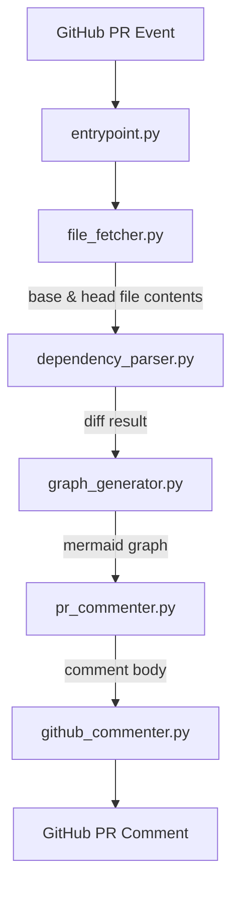

# depgraph-action Architecture

This document describes the architecture and data flow of the `depgraph-action` GitHub Action.

## Overview

`depgraph-action` is a GitHub Action that automatically generates a visual dependency graph diff and posts it as a comment on pull requests. It helps reviewers quickly understand what dependencies were added, removed, or changed.

## Component Diagram



## Modules

### `entrypoint.py`
The main entry point for the action. Reads environment variables injected by GitHub Actions (e.g. `GITHUB_TOKEN`, `GITHUB_REPOSITORY`, `PR_NUMBER`, `BASE_REF`, `HEAD_REF`) and orchestrates the full pipeline.

**Key functions:**
- `get_required_env(name)` — reads a required env var or exits with an error
- `main()` — wires all modules together and drives execution

---

### `file_fetcher.py`
Responsible for fetching the dependency file (e.g. `requirements.txt` or `package.json`) from GitHub at a specific git ref using the GitHub Contents API.

**Key functions:**
- `fetch_file_at_ref(repo, path, ref, token)` — fetches and base64-decodes a file at a given ref
- `detect_dependency_file(repo, ref, token)` — auto-detects which dependency file exists in the repo
- `fetch_base_and_head(repo, base_ref, head_ref, token)` — returns both base and head file contents

---

### `dependency_parser.py`
Parses dependency files into a normalized dictionary of `{package_name: version}` and computes diffs between two snapshots.

**Key functions:**
- `parse_requirements_txt(content)` — parses Python `requirements.txt` format
- `parse_package_json(content)` — parses Node.js `package.json` dependencies
- `parse_dependency_file(content, filename)` — dispatches to the correct parser
- `diff_dependencies(base, head)` — returns added, removed, and changed packages

---

### `graph_generator.py`
Converts parsed dependency data and diffs into [Mermaid](https://mermaid.js.org/) flowchart syntax.

**Key functions:**
- `generate_mermaid_graph(deps, title)` — generates a full dependency graph
- `generate_diff_graph(diff)` — generates a color-coded diff graph (green=added, red=removed, yellow=changed)
- `wrap_in_mermaid_block(graph)` — wraps graph text in a fenced Mermaid code block

---

### `pr_commenter.py`
Builds the markdown comment body combining the diff summary and the Mermaid graph.

**Key functions:**
- `build_comment_body(diff, graph)` — assembles the full comment markdown
- `run_pr_comment(repo, pr_number, diff, graph, token)` — builds and upserts the comment

---

### `github_commenter.py`
Handles raw GitHub API calls for creating and updating PR comments.

**Key functions:**
- `find_existing_comment(repo, pr_number, marker, token)` — searches for a previously posted comment by marker string
- `post_comment(repo, pr_number, body, token)` — creates a new PR comment
- `update_comment(repo, comment_id, body, token)` — edits an existing comment
- `upsert_comment(repo, pr_number, body, marker, token)` — creates or updates based on marker presence

---

## Data Flow

1. The action is triggered by a `pull_request` event.
2. `entrypoint.py` reads env vars and calls `fetch_base_and_head` to get the dependency file at both the base and head refs.
3. Both files are parsed into dependency dicts via `parse_dependency_file`.
4. `diff_dependencies` computes what changed.
5. `generate_diff_graph` produces a Mermaid diagram highlighting the changes.
6. `build_comment_body` wraps the graph and a human-readable summary into markdown.
7. `upsert_comment` posts or updates the comment on the PR, identified by a hidden HTML marker to avoid duplicate comments.

## Comment Marker

To avoid posting duplicate comments on repeated pushes to the same PR, each comment includes a hidden HTML marker:

```html
<!-- depgraph-action -->
```

Before posting, the action searches existing PR comments for this marker and updates in place if found.

## Supported Dependency Files

| File | Ecosystem |
|------|-----------|
| `requirements.txt` | Python (pip) |
| `package.json` | Node.js (npm/yarn) |

Support for additional formats (e.g. `Pipfile`, `pyproject.toml`, `go.mod`) is planned.
